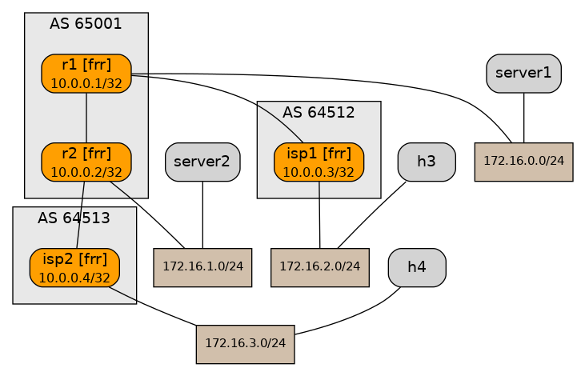

# Network Lab Challenge 1  
In this scenario you have a pair of routers you administer (r1 & r2) that uplink two each other and to an ISP provider.

You have to solve for Ping not reachable between server1/2 and h3/4


You can access all of the devices in the topology but access to the ISP Devices are not required

In order to pass the challenge your solution need to pass the ``validation`` test 



## Install Netlab 
```bash
./setup.sh
```

## Download the Git Repo
```bash
git pull <>
```

## Bring up the lab
```bash
netplan up
```

## Confirm the lab is up
```bash
netplan status
```

### Connect to the devices
```bash
netlab connect <device name>
vtysh 
You can issue commands from the cli via  
netlab connect <device name> --<show ommand>
```

### Validate the fix 
```bash
netlab validate
```


