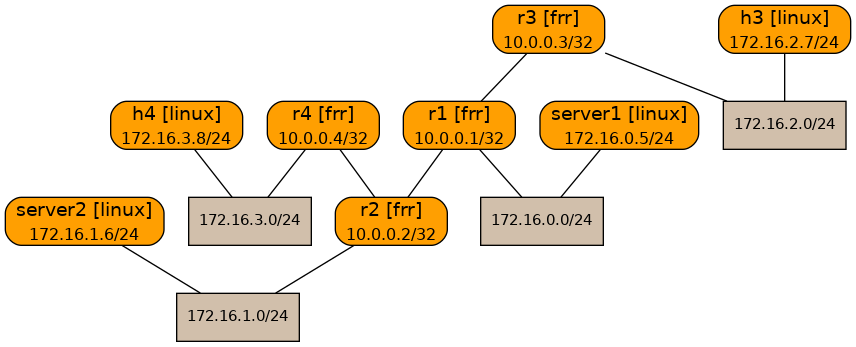

# Network Lab Challenge 2

In this scenario you have 4 routers you administer (r1 -- r4) 

You have to solve for Ping not reachable between 

  - server1 -> h3
  - server1 -> h4
  - server2 -> h3
  - server2 -> h4
  - server1 -> server2

All of the configuration that needs to be fixed is in either r1 and/or r2. 
You can access all of the devices in the topology

In order to pass the challenge your solution need to pass the ``netlab validate`` test 
The ``netlab validate`` test will run a series of pings and validate the results

You can troubleshoot by connecting to the devices and making changes to the configuration
Run time changes can be test with the ``netlab validate`` command

Resolution should be a Pull Request to this repo with the changes you made to the topology.yaml or any other files needed



Successful Validation should look like this 
```bash
netlab validate
[wait]    Waiting for OSPF to converge

[ping1]   Server1 Ping to H3 [ node(s): server1 ]
[PASS]    Validation succeeded on server1
[PASS]    Test succeeded

[ping2]   Server2 Ping to H4 [ node(s): server2 ]
[PASS]    Validation succeeded on server2
[PASS]    Test succeeded

[ping3]   Server1 Ping to Server2 [ node(s): server1 ]
[PASS]    Validation succeeded on server1
[PASS]    Test succeeded

[ping4]   Server1 Ping to H4 [ node(s): server1 ]
[PASS]    Validation succeeded on server1
[PASS]    Test succeeded

[ping5]   Server2 Ping to H3 [ node(s): server2 ]
[PASS]    Validation succeeded on server2
[PASS]    Test succeeded
```
